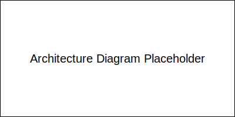

# Zentix Clean - نظام التعلم الذاتي المتقدم

نظام متقدم للتعلم الذاتي والتقييم الذاتي والتحسين الذاتي والتفكير الذاتي.

## المميزات الرئيسية

### 1. نظام التعلم الذاتي (Meta-Learning)
- تحليل البيانات وتقييم الأداء
- تحديد مجالات التحسين
- تطبيق التحسينات وتقييم النتائج
- تحديث حالة التعلم

### 2. نظام التقييم الذاتي (Self-Rating)
- تقييم دقة التحليل العاطفي
- تقييم جودة الاقتراحات
- تقييم أداء التخصيص السياقي

### 3. نظام التحسين الذاتي (Self-Improving)
- تحليل نقاط الضعف
- توليد استراتيجيات التحسين
- تطبيق التحسينات
- تقييم تأثير التحسينات

### 4. نظام التفكير الذاتي (Self-Thinking)
- تحليل أنماط المشاعر
- تحليل أنماط المستخدمين
- تحليل أداء النظام
- تحديث معدل التعلم

## المتطلبات

- Python 3.8+
- PostgreSQL 12+
- Node.js 14+
- React 17+

## التثبيت

1. استنساخ المستودع:
```bash
git clone https://github.com/yourusername/zentix-clean.git
cd zentix-clean
```

2. إنشاء بيئة افتراضية وتثبيت المتطلبات:
```bash
python -m venv venv
source venv/bin/activate  # Linux/Mac
# أو
.\venv\Scripts\activate  # Windows

pip install -r requirements.txt
```

3. إعداد قاعدة البيانات:
```bash
python manage.py db upgrade
```

4. تشغيل الاختبارات:
```bash
pytest
```

5. تشغيل التطبيق:
```bash
python manage.py run
```

## هيكل المشروع

```
zentix-clean/
├── backend/
│   ├── core/
│   │   ├── emotion_engine.py
│   │   ├── meta_learning.py
│   │   ├── contextual_personalization.py
│   │   └── auto_evaluation.py
│   ├── models/
│   │   ├── emotion.py
│   │   ├── user.py
│   │   └── learning.py
│   └── tests/
│       ├── test_emotion_engine.py
│       ├── test_meta_learning.py
│       └── test_integration.py
├── frontend/
│   ├── components/
│   │   └── ui/
│   │       ├── effects/
│   │       └── animations/
│   ├── pages/
│   └── tests/
├── docs/
│   ├── api/
│   └── architecture/
└── scripts/
    ├── setup.sh
    └── deploy.sh
```



يضم مجلد **frontend/components/ui** مجلدين فرعيين `effects/` و `animations/` يضمان أمثلة مبسطة لاستخدام مكتبة **framer-motion** مثل `FadeIn.tsx` و `SlideIn.tsx`.

## المساهمة

1. Fork المشروع
2. إنشاء فرع للميزة الجديدة (`git checkout -b feature/amazing-feature`)
3. Commit التغييرات (`git commit -m 'Add some amazing feature'`)
4. Push إلى الفرع (`git push origin feature/amazing-feature`)
5. فتح Pull Request

## الترخيص

هذا المشروع مرخص تحت رخصة MIT - انظر ملف [LICENSE](LICENSE) للتفاصيل.

## الاتصال

- البريد الإلكتروني: your.email@example.com
- الموقع: https://your-website.com
- Twitter: [@yourusername](https://twitter.com/yourusername)
