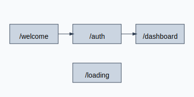

# Zentix Frontend

This directory contains the Next.js interface for the Zentix platform.

## Setup

```bash
npm install
npm run dev
```

The development server will be available at `http://localhost:3000` by default.

## Available Pages

- **`/welcome`** – Introductory page with a call to action.
- **`/auth`** – Login form for authenticating users.
- **`/dashboard`** – Main AI dashboard (also served from `/`).
- **`/loading`** – Full-screen loading indicator.


UI utilities live in `components/ui` including `effects/` and `animations/` folders with simple examples like `FadeIn` and `SlideIn`.

## Building for Production

To create an optimized build of the frontend run:

```bash
npm run build
npm run start
```

The compiled app listens on port `3000` by default.

## Contributing

Refer to the repository [CONTRIBUTING.md](../CONTRIBUTING.md) for general guidelines.
When updating the UI please keep components focused and include tests under
`__tests__` where appropriate.
